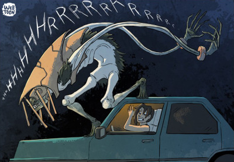

### Earth Spirit

A grey, roughly humanoid creature hunched over, its torso and head covered in heavy armor that looks almost like terracotta. Tusked, with fur poking out from under the armor. Many beady red eyes, long, thin arms and legs that that don't seem to have any joints, wobbling like pieces of rope or tentacle, yet still ending in elongated hands and feet.

hp: 100 +/- 20
AC: 16
str: 10
dex: 17 (+3)
con: 8
wis: 9
int: 12
cha: 10

darkvision 120 feet

CR: 4-5?

speed: 30 ft normal movement + 30 foot leap per turn (leap must be in a single bound)
Its limbs will be severed if hit with any attack that does at least 3 damage. If it is missing one leg its movement drops to 15+0, and cannot move if missing both. An attack that does less than 3 damage punches visible holes, and decreases the amount of damage needed to sever the limb by the damage dealt

Actions: 
- Multiattack: Spririt makes up to two attacks, of any combination of slashing or throwing attacks. Spirit can only attack with a single arm once per turn (if they're missing an arm they can only make one attack)
- Slashing attack: The spirit attacks with one of its arms, telescoping them out and turning its fingers into talons, 
  - +6 to hit dealing (dex) 2d6 + 3 slashing damage. 
  - This attack has a range of 60 feet, but deals half damage to targets <= 20 feet away.
- Throwing attack: The spirit grabs a target and tosses them against a nearby wall. 
  - The target must make a dc 13 dex save, taking 4d6 damage on a failed save. 
  - Cannot grab targets further than 40 feet away, and the wall must be within 40 feet of the target.
- regrow (max once per 3 turns, cannot regrow a limb the turn after it was lost): the spirit regrows a limb entirely, taking 7 damage in the process
- Alternate throwing attack: Spirit throws a target at another creature. 
  - Both must make a dc 13 dex save, taking 2d6 damange on a failed save. 
  - Same range restrictions as the normal throw

#### death
On death the spirit returns to stone. It's limbs crumble to fine sand, its eyes turn to garnets, its torso turns to sandstone, and its fur to thin blades of crystal. The terracotta armor does not change