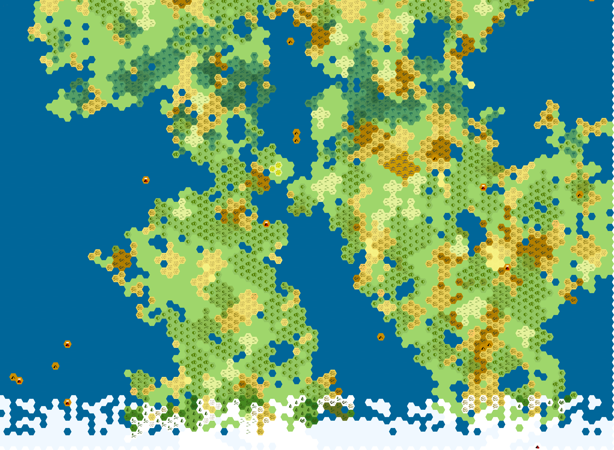

# The Shattered God's Tomb

- [The Shattered God's Tomb](#the-shattered-gods-tomb)
  - [Introduction](#introduction)
  - [The World](#the-world)
  - [The Shattered God's Tomb](#the-shattered-gods-tomb-1)
    - [History](#history)
    - [Aftermath of the Shattering](#aftermath-of-the-shattering)
    - [Description](#description)
    - [Factions](#factions)
      - [The Cult of the Shattered god](#the-cult-of-the-shattered-god)
      - [The Merchants of Adventure](#the-merchants-of-adventure)
      - [The Priests of Ebor](#the-priests-of-ebor)
      - [The Lirian Embassy](#the-lirian-embassy)
      - [The Wild Embassy](#the-wild-embassy)
    - [Characters](#characters)
    - [Locations & Landmarks](#locations--landmarks)
      - [Hope's Rock](#hopes-rock)
      - [The Lower Rock](#the-lower-rock)
      - [The Hope](#the-hope)
    - [Miscellaneous](#miscellaneous)
      - [Vidrite](#vidrite)
      - [Heroes](#heroes)
  - [Appendix A: Species](#appendix-a-species)
  - [Appendix B: Cultures & Civilizations](#appendix-b-cultures--civilizations)
      - [The Divine Kingdom of Kithcaryn](#the-divine-kingdom-of-kithcaryn)
      - [The free city of Liria](#the-free-city-of-liria)
      - [The Federation of Caesal](#the-federation-of-caesal)
      - [The Wild Kingdom](#the-wild-kingdom)
  - [Appendix C: Gods](#appendix-c-gods)
      - [Current pantheon](#current-pantheon)
      - [Deceased/forgotten/un-worshipped gods](#deceasedforgottenun-worshipped-gods)

## Introduction

Welcome! This page is the repository of all knowledge that you, the player, have access to about the world of the Shattered God's Tomb. Things are organized into sections below, but first I need to mention one overarching thing.

I'm running SGT a little different from traditional campaigns. I personally believe that giving players as much choice and freedom as possible is what makes for the best stories, so SGT will be run in a pseudo-open world manner. The setting is limited to just the tomb, not the full map below, but there is no set story I have in mind. 

This is a style I've experienced as a player before, and have found it works well and is a lot of fun. The friend that introduced me to this style ran it and several other open-world style TTRPGs to great success (one campaign's session 0 involved him showing us a 1.1 million square kilometer continent map, then saying "Pick a place you want to start, anywhere at all, and I'll write something for next week." I'm not doing that), so I'm confident it won't implode in my face.

In session one you will be dropped into the setting, but after that you have free reign. There are a variety of factions and characters for you to interact with, who you want to help and who you want to make into an enemy will be decided entirely by your actions. If you want to betray a faction for another part way through, or else eschew them all and do you own thing, all of that is allowed.

Relatedly, if there's something not in the PHB that you really want to play, feel free to ask and I may approve it. By default I'm mostly only allowing base PHB stuff since it's my first time DMing, but if it fits the world and the rules are straightforward enough there's a decent chance I'll say yes.

## The World

(There are no icons/borders/labels on the map because I'm still fleshing out the larger world)

The Shattered God's Tomb is located on the continent of Athol (ATH-all), west of which is the continent Evras (ev-RASS). The continents have been populated for much longer than recorded history, having seen the rise and fall of numerous civilizations, many of whom unfortunately took their knowledge with them. 

Change, some might call it chaos, is the defining trait of Atholian and Evrasian history. Nearly every city is built on the ruins of a far older one, if not many older ones. Few large empires or kingdoms endure more than a scant handful of centuries. Whether by internal stress, war with another nation, or the meddling of a god, mortal attempts at greatness don't seem to last long. The present state of the two continents reflects this; there are only a couple of large kingdoms, and young ones at that. Smaller duchies and city states abound instead.

The cycle of change holds not only for the nations of the two continents, but to the pantheon as well. The gods of Evras and Athol are numerous and powerful, and eternally locked in cold war with each other. Many heroes and kings have been, knowingly or not, nothing more than pawns in the games of gods, and their gambits for power. When those gambits fail, however, a god might find themself struck down by their opponent, whether by direct war in heaven, or by some plucky farmer with a battered sword. Some gods burn so bright and fast that there are individual mortals that lived through their birth and death.

## The Shattered God's Tomb

(Map forthcoming)

### History

Many centuries ago almost all of northern and eastern Athol was controlled by the Mikhesal (MIK-eh-sahl) empire. An extremely expansionistic empire, it quickly rose from a small dukedom to a continent-spanning empire. Mikhesal's success was in part due to the extreme number of storied heroes they managed to enlist, or else emerged during the empires campaigns. Their secret however, was their patronage from the then god of war, Immog. An ancient red dragon so powerful it achieved godhood, Immog's blessing of magical power and weapons made Mikhesal unstoppable.

Shortly after reaching it's first century of existence internal conflict split the empire into two factions, nearly equal in power. A long and bloody civil war culminated in a last stand between the two factions, where both sides brought all the heroes and weapons they could muster. The loyalists, still patronized by Immog, seemed poised to win. In an act of desperation, the rebels' mages banded together to do the one thing they thought would give them a chance at victory and survival, as Mikhesal and Immog were not known for mercy: pull Immog from his plane to the mortal realm and destroy him utterly with a single ritual.

Their plan worked, in a sense. Immog fell screaming to the mortal battlefield, being torn asunder as he fell by the magic of an entire civilization working together. The release of Immog's power, along with the ritual spell itself going out of control, destroyed not just the god but also both armies and hundreds of square miles of land. There were no survivors of the battle, but the shattering of the god and the battlefield was seen or felt on much of the continent. The sheer power of the event broke the bedrock and sent an earthquake travelling through much of the northern bit of the continent.

### Aftermath of the Shattering

The Shattered God's Tomb, as the battlefield where Immog and Mikhesal were destroyed utterly came to be known, was almost completely avoided for centuries after it's overnight creation. The canyons that formed in an instant were deep enough to crack open magma chambers in some places. That, combined with Immog's element of fire being released, made the area far too hot for any person to survive for several centuries, and avoided even longer after that. 

It is only in the last 80 years or so that explorers and adventurers have visited the canyon network. Those who survived exploring their depths and managed to climb back out brought back treasure and weapons of the legendary heroes that were at the battle, but also stories of the powerful monsters birthed by the spilled blood of a god. One story particularly caught peoples' imaginations like wildfire: that Immog himself was not dead, merely broken and dormant. In recent years a town has popped up on the western edge of the Tomb, drawing in adventurers from the world over seeking to find riches and power.

The continent of Athol, after the regime that controlled much of it vanished overnight, went through several centuries of turmoil as the few nobles and cities that didn't send their warriors to the Tomb scrambled for power in the vaccuum. In the present day many duchies and city states can be found, most either unnable or uninterested in expanding their borders.

### Description

A maze of extremely deep sheer canyons, formed by the immense power released at Immog's shattering also breaking the bedrock (for those who read Sanderson, yes it's partially inspired by the shattered plains). The lower walls and bed of the canyons are primarily a mix of basalt, slate, obsidian and marble, igneous and metamorphic rocks formed by the sheer heat and pressure the Shatterring wrought. The walls, at least near the top, are covered by an almost glass-like substance that has come to be known as Vidrite, which some say is the dried blood of the god. Vidrite reflects some light down into the deeps of the canyons below, granting it some some light during most of the day.

Canyons range from 700-1500 metres deep, usually 50-100 metres wide and almost always sheer. The spilled blood and power of a war god and two armies has left the place permeated by powerful magic. Many strange plants grow unnaturally quickly on the base of the canyons allowing for a lot of food without much sunlight. The base of the canyons are colloquially referred to as the Catacombs.

The Town of Hope's Rock was founded on the western edge of the Tomb. Serviced by the Grand Lift, a marvel of engineering made by engineers from the city of Caesal, most of the town is built into the rock at the base of the canyons. Though many people find life in Hope's Rock and the Catacombs to be eerie and claustrophobic, many others find the place immensely beautiful. Between the unique plant and animal life, the vidrite walls of the canyons and the ethereal light from the vidrite suffusing the Catacombs, many artists and poets flock to the place for inspiration.

### Factions

(To be expanded)

#### The Cult of the Shattered god

Founded by explorers in the Catacombs. They worship the fallen god of war, Immog, who they believe is not fully dead yet. Do not take kindly to open worship of other gods, and are particularly not fond of the Priests of Ebor.

#### The Merchants of Adventure
The organization made up of Caesalan merchants and engineers that built both the town of Hope's Rock and the Grand Lift. Widely viewed as greedy bureaucrats, they are famously crafty, but will stick to their word.

#### The Priests of Ebor
Group of priests of the god of peace. Led by Bishop Ormen, they seek to find any truth to the rumors that Immog yet lives. They do not take kindly to the shattered cult.

#### The Lirian Embassy
Agents of the Free City of Liria, searching the Catacombs for any and all enchanted objects, especially those extremely powerful artifacts they can learn new magic from. Some claim they are especially interested in the magical weapons, hoping to build up an arsenal to increase Liria's domain.

#### The Wild Embassy
Not actually an official delegation, but a collection of inhabitants from the Wild Kingdom that seek to find rare creatures in the Tomb. Many people

### Characters

To be added later. 

### Locations & Landmarks

(To be expanded)

#### Hope's Rock
(Map forthcoming)
The town surrounding the Grand Lift. Separated into the Upper Rock at the top of the lift, and the Lower Rock at its base. Named after the huge vidrite boulder, of the same material of the walls of the cliffs, next to which resides the lift. The Upper Rock is far smaller, mostly only for unloading supplies to be sent to the Lower Rock. The lower rock is far larger and centered around the meeting of 3 canyons, resulting in the three major (and only) streets of the lower town. 

#### The Lower Rock
The town at the base of the Grand Lift. Comprised of a central square and three major streets walled off from the rest of the canyon network, defined by the natural floor of the canyon. Each street is named after the monster that most plagued the early denizens of the Lower Rock when trying to wall off that passageway. The street that heads north of the square is named Beholder's boulevard, the street veering southeast is Demon's lane, and the southbound street is Dragon's gulch.

#### The Hope
The outcrop of vidrite nearly 50 feet tall around which the town of Hope's Rock was built and named. Some claim it's shaped like a fang, though many dismiss this, saying the resemblance is rough at best. The only known piece of vidrite not attached to the walls of the canyons, at its peak appears to be a blue banner, encased in vidrite but still mostly visible through the crystal. Whatever symbol might have been present on the banner cannot be seen. Its unknown what material the banner is made of, as any flammable materials were reduced to ash during the shattering.

### Miscellaneous

#### Vidrite

The name for the glass- or quartz-like substance that coats the walls of the canyons. Extremely hard and translucent, few have managed to chip a piece off to study it, and those who have closely guard their samples and findings. Almost always extremely smooth, looking like if glass had the gentle curves of a calm sea. Very difficult to climb, as it's nearly impossible to get any purchase. Claimed by some to be the ichor of Immog himself. Many scholars presume it to be ordinary stone created by the unique conditions surrounding Immog's shattering, though the lack of any obvious crystalline structure to it and the curved surfaces cause problems with this theory.

#### Heroes

This world has seen many adventurers, some of whose legacy can still be felt. Adventurers are usually called heroes, which takes on the meaning of "larger than life," someone who seems to have strange and unlikely experiences more than usual, and not necessarily a virtuous one. Fate seems to twist the odds in the areas around them causing unlikely occurrences to suddenly become very likely. Some people try to prove themselves worthy of fate, and others try to find heroes, those people in whom fate seems to take an interest, and use them for their gain, though fate has a way of striking back at those who try such things.

## Appendix A: Species

Player available species:
- Humans
- Elves
- Half-elves
- Half-orcs
- Gnomes
- Halflings
- Dwarves
- Tieflings
- Dragonborn
- Kenku
- Aasimar
- Tabaxi
- Goliaths

Species that exist in the world:
- Humans
- Elves
- Half-elves
- Half-orcs
- Gnomes
- Halflings
- Dwarves
- Tieflings
- Dragonborn
- Kenku
- Aasimar
- Tabaxi
- Goliaths
- Goblins
- Hobgoblins
- Bugbears
- Orcs
- Kobolds
- Lizardfolk

## Appendix B: Cultures & Civilizations

#### The Divine Kingdom of Kithcaryn
Kingdom on the west of Evras ruled by the God-King of Kithcaryn (KITH-carn). Largest and oldest currently-standing regime on either continent, around 400 years old. A haven for people of all species and creeds. Worship of other gods is allowed, though the churches to other gods tend to be fewer and smaller than in other lands. Worship of the more evil leaning gods is strictly allowed, but heavily frowned upon by most of the society, and rather rare. The divine kingdom frequent and large festivals all throughout the country, and values kindness, generosity and art. 

Located in an area of plains, prairies and forests all abounding with life, by far the most bountiful land on the continent. It has little desire to expand their borders or value in martial prowess, but is keen to spread their philosophy and worship of the God-King to other lands. Strong relations with the Wild Kingdom, as there is a mutual philosophy of generosity and helping one's peers, though the civilization vs. nature bit prevents anything more than strong ties. Many travellers to the kingdom and outsiders view the citizens of Kithcaryn as naive and coddled. The kingdom's borders are mostly open, due to their belief that all should aid and welcome each, but this can cause some strife as outsiders maintain their harsher ways of life within the kingdom.

The god Kithcaryn is unique in residing on the mortal plane. They rule their country directly from their palace in the city of Marroux. It is unknown who or what they were in their life before achieving godhood, as the god is always seen wearing armor made of an opaque sky-blue crystal. All that is known is that they are humanoid, as even reports of their height, from the few times non-priests are granted audiences, vary.

#### The free city of Liria 
Liria (LEER-ee-uh) is a city state on the north-eastern coast of Athol ruled by a cabal of wizards and sorcerors. Once the capital of Mikhesal, after the shattering a group of powerful magic users seized control. It is unknown where these mages came from, as with how powerful they were, they ought to have been at the battle if they hailed from Mikhesal. Opposed to warlocks, druids, clerics and most gods, as they do not wish to invite meddling by outside magical forces. The only magic allowed is innate or self-learned magic including tha magic of bards, rangers, rogues and monks. The only gods allowed to be worshipped are those whom the cabal approves of - usually those gods with whom the leaders have spoken to and written up an explicit treaty, detailing what can be preached and what rites and magic can be invoked in the city. The leaders keep the true extent of their power as hidden as possible, but from what is known they could easily frustrate the schemes of gods, if not directly compete with some.

#### The Federation of Caesal
In contrast to Liria, Caesal (KAY-sahl) is a free duchy founded by a mage-killer hero (Lilnia "Blink" Chaemenor, female half-elf) in the wake of the Shattering that is opposed to magic, including most gods. Located on the western edge of Athol and close to Evras, they believe magic and the gods is what has held the mortal races back from true greatness, and is the cause of the fall of civilizations, and their knowledge with them. The fall of Mikhesal which led to the founding of Caesal is prime evidence of this to their mind.

Caesal is an oligarchy controlled by prominent scholars, and merchants, no nobility or aristocrats. Highly value philosophy, the sciences, engineering and physical prowess. Magic is allowed so long as it is in the pursuit of furthering the understanding of the world, not simply power. Caesalans views magic much like fire: extremely dangerous, volatile, and likely to cause destruction if left unchecked, but useful and worth the risk if controlled and used only with sufficient expertise. Licenses to practice magic and alchemy can be acquired through some difficulty. Clerics and warlocks can still acquire these licenses as the Caesalans are not opposed to leveraging gifts of power granted from outside sources, though some internal factions question the wisdom of this. Their strict control of magic within their borders is enforced by an elite force of mage-killers colloquially known as Blinkers, named after the founder's nickname of Blink. Lilnia got this nickname due to her extreme speed, use of stealth, and how the magical aura of her targets would simply blink out of existence

#### The Wild Kingdom
A loose alliance of tribes and individuals of many species who value nature and reject large civilization, industry and agriculture. Located on central Athol with rather indistinct borders, it is comprised of humans, halflings, wood-elves, goliaths, bugbears, orcs, kobolds and various other naturalistic sentient species. The former 3 species tend to be the ambassadors to outside governments, being the most knowledgeable with the ways of organized civilization. A high king is elected by the leaders of each of the species majorly represented in the kingdom. While many citizens of the wild eat meat, killing other creatures is frowned upon, and the kingdom is a haven for many monsters so long as they do not harm any other sentient being. Harming other sentient creatures and needless destruction of nature are among the highest crimes in the kingdom.

Few travellers from the outside world visit the kingdom beyond the small villages and hamlets built by the more civilized citizens on the edge of the kingdom. The wild king does not extend their protection to visitors. Wild citizens will not be punished for attacking invadors from the civilized world, but neither will visitors be punished for defending themselves.

## Appendix C: Gods

(WIP)

#### Current pantheon

| Name		|	Title							| Alignment		| Symbol					| Species		|
|---		|---								|---			|---						|---			|
|			| God of Death						| LN			| None						| Unknown		|
| Ilin		| Lord of Luck						| CN			| 							| Half-elf		|
| Ebor		| God of Peace						| NG			| A shield					| Unknown		|
| Achiel	| God of Tragedy					| CE			| 3 tear drops				| Elf			|
| Sandard	| God of War						| LE			| 							| Direwolf		|
|			| God of Storms						| NE			| A lightning bolt			| Storm Giant	|
|			| God of The Sea					| CN			| 							| Human			|
| Maha		| Goddess of Nature					| CG			| 							| Halfling		|
| Galungal	| God of The Sky					| NG			| 							| Dragon		|
| Gagdar	| God of The Earth					| LN			| 							| Dwarf			|
| Sarabu	| God of Decay						| LE			| A maggot					| Dragonborn	|
| Finde		| Goddess of Health					| LG			| 							| Unknown		|
|			| God of Pestilence					| NE			| 							| Unknown		|
|			| God of Discovery					| CG			| 							| Tabaxi		|
|			| God of Dreams & Nightmares		| LE			| 							| Mind Flayer	|
|			| God of Wine and Merriment			| CN			| 							| Halfling		|
| Baltha	| God of Deception					| CE			| None						| Kenku			|
| Kasdail	| God of Courage & Valor			| LG			| A golden heart			| Goliath		|
| Akkum		| God of Justice					| LN			| Iron scales				| Unknown		|
|			| Patron of Thieves					| CN			| A key						| Unknown		|
|			| Patron of Hunters					| N				| A silver bow				| Wood-elf		|
|			| The Beggar God					| CG			| A cracked wooden bowl		| Unknown		|
|			| The Immortal Poet					| NG			| A lute & feather pen		| Unknown		|
|	Kithcaryn	| The God-King of Kithcaryn			| CG			| 							| Unknown	|
|			| The Father						| N				| 							| Human			|
| Immog		| The Shattered God					| NE			| A cracked fang			| Red Dragon	|

#### Deceased/forgotten/un-worshipped gods

| Name		|	Title							| Alignment		| Symbol					| Species		|
|---		|---								|---			|---						|---			|
|			| God of War						| LN			| None						| Orc			|
| Immog		| God of War						| NE			| A fiery fang				| Red Dragon	|
|			| God of War						| N				| None						| Giant			|
|			| God of War						| NE			| None						| Lion			|
| Unknown	| Patron god of the Kenku			| Unknown		| Unknown					| Unknown		|