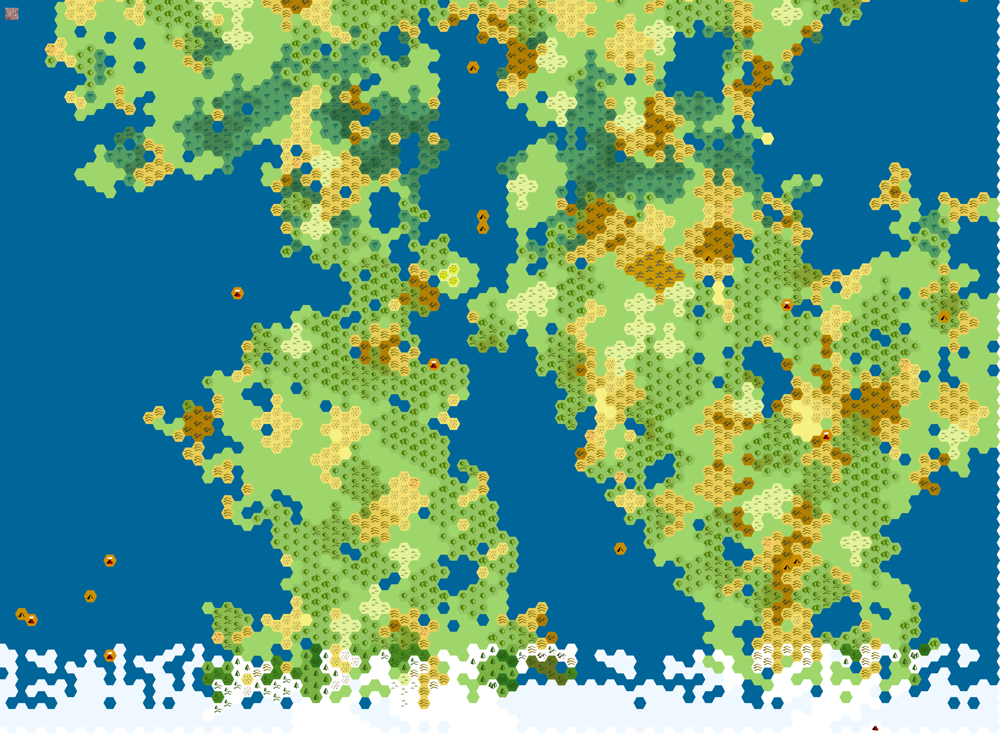

# World

<!-- 

Assuming Equirectangular projection.

World is 174*87 hexes, each hex is then approximately 2.057 degrees in height and width (2 degrees, 2 arc minutes, 25.71 arc seconds or 35.9 milliradians). Works out to 229 km across at the equator, or 162 km across at 45$$\degree$$ north, using earth radius. -->

<!-- ## Legend
- Green - grassland/plain #88B879
- Dark (forest) green - forest
  - Different greens for different types of forest?
  - 
- Yellow - sand #FAFAD2
- Gold/orange - farmland/prairie #DAA520
- White - snow #FFFFFF
- Grey - stone #7B7B7B
- some kind of blue? - Canal

Icons needed:
- Village
- City
- Castle
- Mountain
- Ruins
- Port?
- Volcano? -->

~95 * 56 hexes, 1152 * 672 miles, 775000 square miles

Aim for 100 * 60 hexes for easier math. 1200 * 720 miles, 864000 square miles.

Eastern continent - Athol. People called Atholians.

Western continent - Evras. People called Evrasians.

## Travelling
By Land:
Slow Pace: 30 km/Day
Normal Pace: 40 km/Day
Fast Pace: 50 km/Day